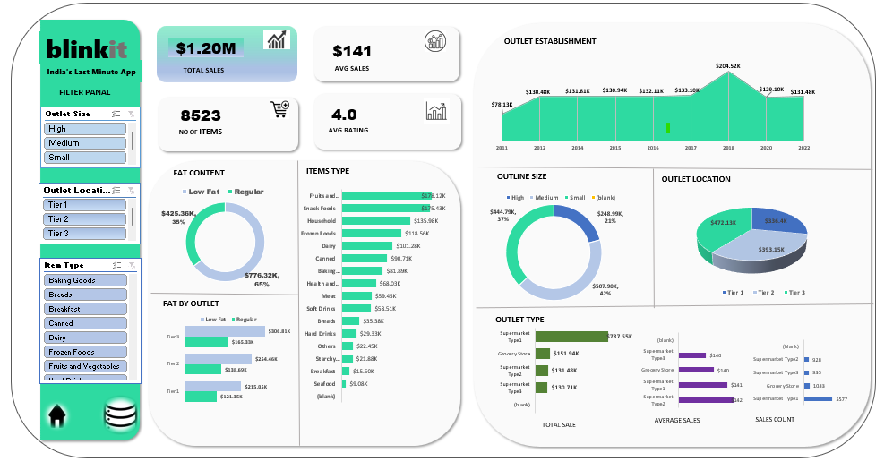

# BlinkIT Grocery Data Visualization Dashboard
 (Interactive Dashboard creation using MS Excel)

## Project Objective
This Excel dashboard analyzes BlinkIT’s grocery sales data, offering insights into total sales, item types, outlet size, and location performance. It uses pivot tables, slicers, and visual charts to explore trends in fat content, outlet growth, and customer preferences, helping optimize inventory, sales strategy, and business expansion decisions.

## Dataset used
- <a href="https://github.com/kuketha/BlinkIT_Data_Analysis/blob/main/blinkit_row_dataset.xlsx">Dataset</a>

## Questions (KPIs)
1. 💰 What is the total sales across all outlets?
→ Helps understand overall business revenue performance.

2. 📦 Which item types contribute the most to sales?
→ Identifies high-performing product categories.

3. 🏢 How do different outlet sizes (Small, Medium, High) impact sales?
→ Evaluates whether larger outlets drive more business.

4. 🌍 Which outlet locations (Tier 1, 2, 3) generate the most revenue?
→ Analyzes regional performance trends.

5. 🧈 How is fat content (Low Fat vs Regular) affecting sales?
→ Useful for inventory planning and customer health preference insights.

6. 📈 What are the trends in outlet establishment over time?
→ Shows growth in number of outlets from past years.

7. 📊 What are the average sales and item count per outlet and category?
→ Reveals outlet efficiency and category-level contribution.

- Dashboard Interaction <a href="https://github.com/kuketha/BlinkIT_Data_Analysis/blob/main/blinkit_dashboard.png">View Dashboard</a>

## Process
1. Data Collection:
Imported raw sales data from the BlinkIT Grocery Data sheet.
Dataset includes sales, item type, fat content, outlet size, location, establishment year, and more.

2. Data Cleaning:
Verified consistency in categorical fields (e.g., "Low Fat", "Regular").
Handled missing values (if any) and normalized the structure.

3. Pivot Table Creation:
Generated pivot tables for total sales, item types, outlet performance, and fat content.

4. Dashboard Design:
Built interactive charts (bar, doughnut, line, pie) in the Dashboard sheet.
Used Slicers for filtering by:
Outlet Size
Outlet Location
Item Type

5. Visualization:
Plotted metrics like total sales, fat content distribution, and outlet trends.
Used dynamic visuals to highlight the impact of filters.

## Dashboard

## Project Insight

🏙 Tier 1 cities generate the highest revenue, contributing over $593K in sales.
- High-size outlets dominate the revenue share compared to small or medium ones.
- Regular fat content items make up a significantly higher portion of total sales.
- Frozen Foods, Dairy, and Snack Foods are top-performing item types.
- Outlet establishment shows a strong upward trend from 2013 to recent years.
- Average sales per item is $141, with an average rating of 4.0, indicating good customer satisfaction.

## Final Conclusion:
The BlinkIT Grocery Dashboard offers a powerful business intelligence tool to analyze sales performance across products and outlets. It reveals that:
Outlet location and size heavily influence overall revenue.
Certain item categories (Frozen Foods, Dairy) are essential for driving sales.
Regular fat items remain top-selling, suggesting customer preferences.
The business is expanding steadily, as seen in outlet establishment trends.
These insights can help BlinkIT's management optimize inventory, target high-potential regions, and make data-driven marketing and expansion decisions.

